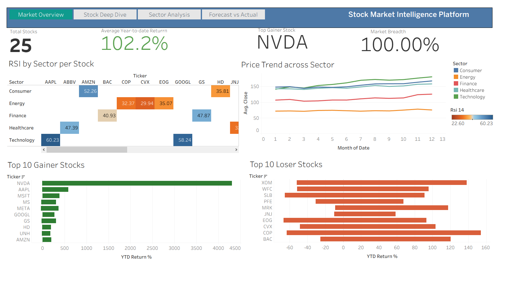
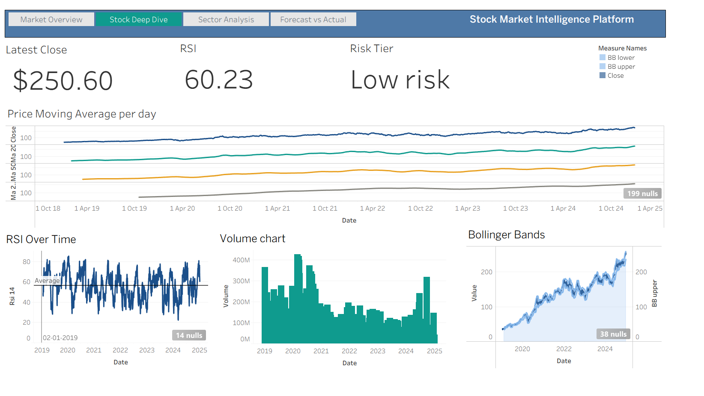

# Stock Market Intelligence Platform

An end-to-end cloud-native analytics platform that ingests live stock market data, stores it in an AWS S3 data lake, applies technical indicator engineering and ARIMA time-series forecasting, and visualizes everything through an interactive Tableau dashboard suite.

---

## Overview

This project simulates a real-world financial analytics pipeline — pulling live OHLCV (Open, High, Low, Close, Volume) data for 25 stocks across 5 sectors, transforming it with technical indicators used by traders and analysts, forecasting future prices with ARIMA models, and delivering insights through a 4-dashboard Tableau suite.

**Business questions this answers:**
- Which stocks and sectors are outperforming the market?
- What is the current trend and momentum for any given stock?
- Which stocks are overbought, oversold, or showing high volatility?
- How correlated are different sectors — where's the diversification benefit?
- What does a stock's price look like 30/60/90 days out, with confidence intervals?

---

## Architecture

```
yfinance API
      │
      ▼
AWS S3 — raw zone (JSON, partitioned by ticker/date)
      │
Python transform (technical indicators)
      │
      ▼
AWS S3 — clean zone (Parquet, columnar + compressed)
      │
      ├──────────────────┐
      ▼                  ▼
Python + ARIMA      Local sync (aws s3 sync)
(pmdarima)                │
      │                  ▼
      ▼            Tableau Desktop
AWS S3 — forecast zone   (data source extract)
      │
      └──────────────────┘
                    │
                    ▼
          Tableau Dashboard Suite
```

---

## Tech Stack

| Layer | Technology |
|---|---|
| Data source | Yahoo Finance API (`yfinance`) |
| Cloud storage | AWS S3 (raw / clean / forecast zones — data lake pattern) |
| Cloud access | AWS IAM (least-privilege roles), AWS CLI, boto3 |
| ETL | Python (Pandas, NumPy) |
| File formats | JSON (raw), Parquet (clean, columnar compression) |
| Forecasting | ARIMA / auto-ARIMA (`statsmodels`, `pmdarima`) |
| BI / Visualization | Tableau Desktop |
| Logging | Loguru |
| Version control | Git |

---

## Data Pipeline

### 1. Extract — `src/extract/extract.py`
Pulls 5 years of daily OHLCV history for 25 stocks across 5 sectors (Technology, Finance, Healthcare, Energy, Consumer) via the `yfinance` API. Each ticker is written as a date-partitioned JSON object to the S3 raw zone:

```
s3://stock-market-raw-sm/stocks/raw/{TICKER}/{DATE}.json
```

### 2. Transform — `src/transform/transform.py`
Reads raw JSON from S3, computes technical indicators per ticker, and writes clean Parquet files back to S3:

- Moving averages (20/50/200-day)
- RSI (Relative Strength Index, 14-day)
- Bollinger Bands (upper/lower/width)
- Daily and cumulative returns
- 20-day and 60-day rolling volatility
- Golden cross / death cross signals
- 52-week high/low and % from high
- Volume ratio vs 20-day average volume

```
s3://stock-market-clean-sm/stocks/clean/{TICKER}.parquet
s3://stock-market-clean-sm/stocks/clean/master/all_stocks.parquet
```

### 3. Forecast — `src/forecast/forecast.py`
Fits an `auto_arima` model per stock on the closing price series and generates 30/60/90-day forecasts with 95% confidence intervals. Forecast output is written to S3:

```
s3://stock-market-forecast-sm/stocks/forecast/{TICKER}_forecast.csv
s3://stock-market-forecast-sm/stocks/forecast/master/all_forecasts.csv
```

### 4. Load into Tableau
Clean and forecast master files are synced locally (`aws s3 sync`) and connected directly into Tableau as a live data source, related on `Ticker`.

---

## SQL Analytics Layer

20+ analytical queries covering:
- Price & returns analysis (YTD return, top gainers/losers, monthly trends)
- Technical indicator signals (RSI status, MA crossover trends, golden/death cross events)
- Volatility & risk (Sharpe ratio, max drawdown, risk tiering)
- Sector analysis (YTD comparison, sector RSI, sector correlation matrix)
- Volume & market signals (unusual volume, YoY comparison, composite ranking, win/loss streaks)

Built using window functions (`RANK`, `LAG`, `PERCENT_RANK`), CTEs, and Snowflake-native functions.

---

## Dashboards

**1. Market Overview** — total stocks tracked, average YTD return, top gainer, market breadth, sector price trends, top 10 gainers/losers, RSI heatmap by sector.

**2. Stock Deep Dive** *(interactive — parameter-driven)* — select any of the 25 tickers to view live-updating price + moving average charts, RSI over time with overbought/oversold reference lines, volume, and Bollinger Bands.

**3. Sector Analysis** — sector YTD return comparison, sector volatility, sector average RSI, sector correlation matrix.

**4. Forecast vs Actual** — historical price with 30/60/90-day ARIMA forecast overlay and confidence interval bands.

All dashboards share a consistent navigation bar for switching between views.

---

## Screenshots

<!-- Add dashboard screenshots below -->

### Market Overview


### Stock Deep Dive



---

## Project Structure

```
stock_market_platform/
├── src/
│   ├── extract/
│   │   └── extract.py          # yfinance → S3 raw
│   ├── transform/
│   │   └── transform.py        # S3 raw → S3 clean (indicators)
│   ├── forecast/
│   │   └── forecast.py         # ARIMA forecasting → S3 forecast
│   └── utils.py                 # shared config, S3, logging helpers
├── sql/
│   └── analytics/               # 20+ SQL analytics queries
├── data/
│   ├── clean/                   # local sync of S3 clean zone
│   └── forecast/                # local sync of S3 forecast zone
├── dashboards/
│   └── stock_market_dashboards.twbx
├── config/
│   ├── config.yaml
│   └── aws_config.yaml
├── screenshots/
├── requirements.txt
└── README.md
```

---

## Key Skills Demonstrated

- **Cloud data engineering** — AWS S3 data lake design (raw/clean/forecast zone separation), IAM role-based access, boto3 SDK integration
- **API-based ingestion** — live data pulls vs static file processing
- **Data engineering** — Parquet columnar storage, partitioned file layouts, ETL pipeline design
- **Financial domain analytics** — technical indicators (RSI, Bollinger Bands, moving averages), risk/volatility metrics
- **Time-series forecasting** — ARIMA modeling, confidence interval interpretation
- **Advanced SQL** — window functions, CTEs, correlation analysis
- **BI development** — parameter-driven interactive Tableau dashboards, multi-dashboard navigation UX

---

## Setup

```bash
# Clone and install dependencies
git clone <repo-url>
cd stock_market_platform
python -m venv venv
venv\Scripts\activate          # Windows
pip install -r requirements.txt

# Configure AWS CLI
aws configure

# Configure config/aws_config.yaml and config/config.yaml
# (see config templates in /config)

# Run the pipeline
python src/extract/extract.py
python src/transform/transform.py
python src/forecast/forecast.py

# Sync data locally for Tableau
aws s3 sync s3://your-clean-bucket/stocks/clean/ data/clean/
aws s3 sync s3://your-forecast-bucket/stocks/forecast/ data/forecast/
```
